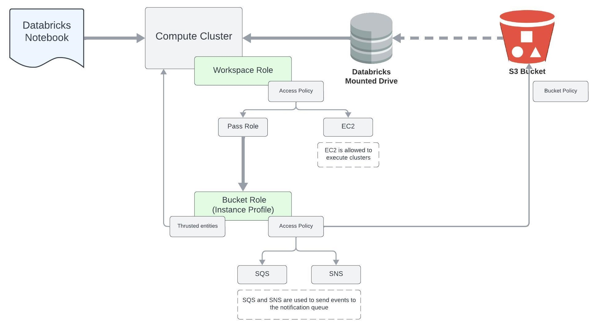
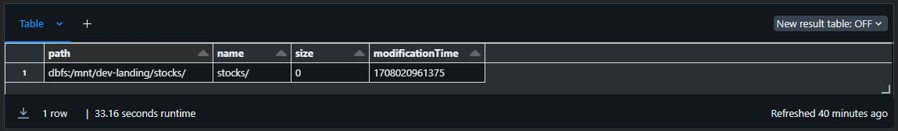

### Related Documentation
- [Project Main Documentation](../../../README.md)
- [AWS Setup](main.md)

## Main concept



# Creating an instance profile 


## Step 0: All the details to do the setup
Note: those are fictive identifiers
```json
{
	"aws_account_id" : 123456789012,
	"databricks_workspace_id" : 8881234567890123
	"arn_role": "arn:aws:iam::123456789012:role/databricks-access",
	"arn_instance_profile" : "arn:aws:iam::123456789012:instance-profile/databricks-access",
	"arn_role_databricks" : "arn:aws:iam::123456789012:role/databricks-workspace-stack-8eb66-role",
	"s3_bucket" : "s3://dev-landing-layer/stocks/"
}
```

## Step 1: Create an instance profile using the AWS console

- [Instance profile created](https://us-east-1.console.aws.amazon.com/iam/home?region=us-east-1#/roles/details/databricks-access?section=permissions)
    - ARN: ```arn:aws:iam::123456789012:role/databricks-access```
    - Instance Profile ARN: ```arn:aws:iam::123456789012:instance-profile/databricks-access```


- [S3 Bucket Created](https://s3.console.aws.amazon.com/s3/buckets/dev-landing-layer?region=us-west-2&bucketType=general&tab=objects)
    - S3 Bucket Name: ```dev-landing-layer```


JSON Permissions in databricks-access-policy 
```json
{
	"Version": "2012-10-17",
	"Statement": [
		{
			"Effect": "Allow",
			"Action": [
				"s3:ListBucket"
			],
			"Resource": [
				"arn:aws:s3:::dev-landing-layer"
			]
		},
		{
			"Effect": "Allow",
			"Action": [
				"s3:PutObject",
				"s3:GetObject",
				"s3:DeleteObject",
				"s3:PutObjectAcl"
			],
			"Resource": [
				"arn:aws:s3:::dev-landing-layer/*"
			]
		}
	]
}
```

## Step 2: Enable the policy to work with serverless resources
[Link to instance profile](https://us-east-1.console.aws.amazon.com/iam/home?region=us-east-1#/roles/details/databricks-access?section=permissions)

Databricks Workspace ID: ```8881234567890123```


Added the thrusted entities to databricks-access
```json
{
    "Version": "2012-10-17",
    "Statement": [
        {
            "Effect": "Allow",
            "Principal": {
                "Service": "ec2.amazonaws.com"
            },
            "Action": "sts:AssumeRole"
        },
        {
            "Effect": "Allow",
            "Principal": {
                "AWS": "arn:aws:iam::790110701330:role/serverless-customer-resource-role"
            },
            "Action": "sts:AssumeRole",
            "Condition": {
                "StringEquals": {
                    "sts:ExternalId": [
                        "databricks-serverless-8881234567890123"
                    ]
                }
            }
        }
    ]
}
```


## Step 3: Create the bucket policy

[S3 Bucket](https://s3.console.aws.amazon.com/s3/buckets/dev-landing-layer?region=us-west-2&bucketType=general&tab=objects)

Values changed
- aws-account-id-databricks: 123456789012
- iam-role-for-s3-access: databricks-access
- s3-bucket-name: dev-landing-layer


Full bucket policy
```json
{
	"Version": "2012-10-17",
	"Statement": [
		{
			"Sid": "Example permissions",
			"Effect": "Allow",
			"Principal": {
				"AWS": "arn:aws:iam::123456789012:role/databricks-access"
			},
			"Action": [
				"s3:GetBucketLocation",
				"s3:ListBucket"
			],
			"Resource": "arn:aws:s3:::dev-landing-layer"
		},
		{
			"Effect": "Allow",
			"Principal": {
				"AWS": "arn:aws:iam::123456789012:role/databricks-access"
			},
			"Action": [
				"s3:PutObject",
				"s3:GetObject",
				"s3:DeleteObject",
				"s3:PutObjectAcl"
			],
			"Resource": "arn:aws:s3:::dev-landing-layer/*"
		}
	]
}
```


## Step 4: Locate the IAM role that created the Databricks deployment
IAM role created the Databricks deployment: ```arn:aws:iam::123456789012:role/databricks-workspace-stack-8eb66-role```


## Step 5: Add the S3 IAM role to the EC2 policy

Changed values
- aws-account-id-databricks: 123456789012
- iam-role-for-s3-access: databricks-access


Full Policy
```json
{
	"Version": "2012-10-17",
	"Statement": [
		{
			"Action": [
				"ec2:AllocateAddress",
				"ec2:AssignPrivateIpAddresses",
				"ec2:AssociateDhcpOptions",
				"ec2:AssociateIamInstanceProfile",
				...
			],
			"Resource": [
				"*"
			],
			"Effect": "Allow",
			"Sid": "Stmt1403287045000"
		},
		{
			"Effect": "Allow",
			"Action": "iam:PassRole",
			"Resource": "arn:aws:iam::123456789012:role/databricks-access"
		},
		{
			"Condition": {
				"StringLike": {
					"iam:AWSServiceName": "spot.amazonaws.com"
				}
			},
			"Action": [
				"iam:CreateServiceLinkedRole",
				"iam:PutRolePolicy"
			],
			"Resource": [
				"arn:aws:iam::*:role/aws-service-role/spot.amazonaws.com/AWSServiceRoleForEC2Spot"
			],
			"Effect": "Allow"
		}
	]
}
```

## Step 6: Add the instance profile to Databricks

- Tried with ```arn:aws:iam::123456789012:instance-profile/databricks-access```
And it worked

AWS ACCOUNT ID
123456789012

ARN
arn:aws:iam::123456789012:role/databricks-access

Instance profile ARN
arn:aws:iam::123456789012:instance-profile/databricks-access


IAM role that created the Databricks deployment
arn:aws:iam::123456789012:role/databricks-workspace-stack-8eb66-role


## Step 7: Mount the S3 bucket in databricks
Add this in a notebook and run it
```python
# From doc: https://docs.databricks.com/en/dbfs/mounts.html#id1

aws_bucket_name = "dev-landing-layer"
mount_name = "dev-landing"
dbutils.fs.mount(f"s3a://{aws_bucket_name}", f"/mnt/{mount_name}")
display(dbutils.fs.ls(f"/mnt/{mount_name}"))
```




## Step 8: Add a notification queue to the bucket
https://docs.databricks.com/en/ingestion/auto-loader/file-notification-mode.html

To use file notification mode, attach the following JSON policy document to your IAM user or role.
- bucket-name: dev-landing-layer
- region: us-west-2
- account-number: 123456789012
```json
{
  "Version": "2012-10-17",
  "Statement": [
    {
      "Sid": "DatabricksAutoLoaderSetup",
      "Effect": "Allow",
      "Action": [
        "s3:GetBucketNotification",
        "s3:PutBucketNotification",
        "sns:ListSubscriptionsByTopic",
        "sns:GetTopicAttributes",
        "sns:SetTopicAttributes",
        "sns:CreateTopic",
        "sns:TagResource",
        "sns:Publish",
        "sns:Subscribe",
        "sqs:CreateQueue",
        "sqs:DeleteMessage",
        "sqs:ReceiveMessage",
        "sqs:SendMessage",
        "sqs:GetQueueUrl",
        "sqs:GetQueueAttributes",
        "sqs:SetQueueAttributes",
        "sqs:TagQueue",
        "sqs:ChangeMessageVisibility"
      ],
      "Resource": [
        "arn:aws:s3:::dev-landing-layer",
        "arn:aws:sqs:us-west-2:123456789012:databricks-auto-ingest-*",
        "arn:aws:sns:us-west-2:123456789012:databricks-auto-ingest-*"
      ]
    },
    {
      "Sid": "DatabricksAutoLoaderList",
      "Effect": "Allow",
      "Action": [
        "sqs:ListQueues",
        "sqs:ListQueueTags",
        "sns:ListTopics"
      ],
      "Resource": "*"
    },
    {
      "Sid": "DatabricksAutoLoaderTeardown",
      "Effect": "Allow",
      "Action": [
        "sns:Unsubscribe",
        "sns:DeleteTopic",
        "sqs:DeleteQueue"
      ],
      "Resource": [
        "arn:aws:sqs:us-west-2:123456789012:databricks-auto-ingest-*",
        "arn:aws:sns:us-west-2:123456789012:databricks-auto-ingest-*"
      ]
    }
  ]
}

```

In a notebook we can then set the notification rule to true when we store with streaming (see auto loader doc)


# Other

Testing IAM Policy with simulator
 https://policysim.aws.amazon.com/