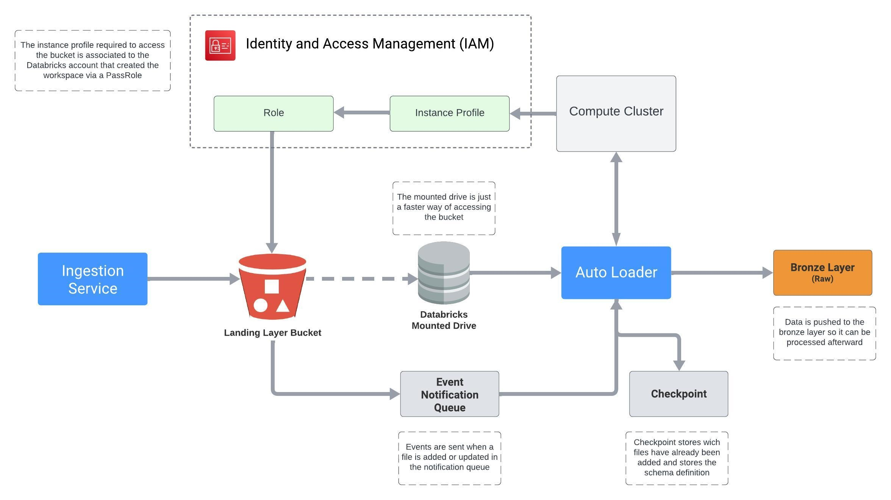

#### Documentation Menu
- [Project Main Documentation](../../../README.md)
<br><br><br>

# Spark Streaming and autoloader




## Example Code
```python
# Import functions
from pyspark.sql.functions import col, current_timestamp
#from pyspark.sql.types import *
#import json

# Parameters
file_path = "/mnt/dev-landing/stocks/"
table_name = "stocks"
schema_name = "dev_bronze"
catalog_name = "dev"
checkpoint_path = "/mnt/AutoLoader/_checkpoint/stocks"

# Defining the cloudfiles options and the checkpoint path for registering the schema using schema inference on first load
cloudfile_options = {
    "cloudFiles.format": "json",
    "cloudFiles.schemaLocation": checkpoint_path,
    "cloudfiles.useNotifications": "true",
    "cloudFiles.schemaEvolutionMode": "rescue",
    "cloudFiles.maxFilesPerTrigger": 1000,
    "cloudFiles.maxBytesPerTrigger": "10g"
}

# Obtaining data from spark readstream
# Can we use the cloudnotifications to get only new files
streamingDF = (spark.readStream
  .format("cloudFiles")
  .options(**cloudfile_options)
  .load(file_path)
  .select("*", col("_metadata.file_path").alias("source_file"), current_timestamp().alias("processing_time")))

# Can we merge the data instead of just writing
(streamingDF.writeStream
  .option("checkpointLocation", checkpoint_path)  
  .trigger(availableNow=True)
  .toTable(f"{catalog_name}.{schema_name}.{table_name}", mode="append"))
```
