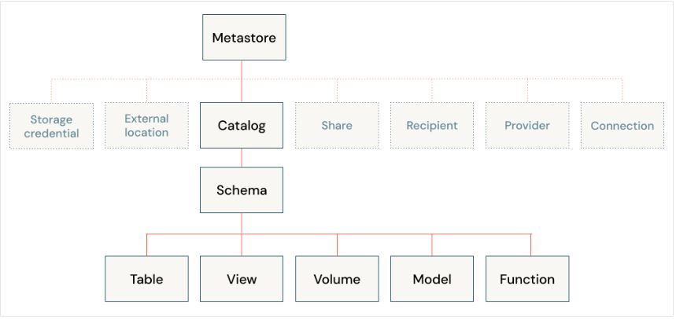

#### Documentation Menu
- [Project Main Documentation](../../../README.md)
   

# Unity Catalog

## Meta Store in Unity Catalog

**Unity Catalog MetaStore Provides:**
- centralized access control
- auditing
- lineage
- data discovery capabilities
- can be used across multiple workspaces

**Unity Catalog Metastore Storage:**
- Configured with a root storage location in an S3 bucket in your AWS account
- This storage location is used by default for storing data for managed tables.

**Unity Catalog Access Management**
- Data is secure by default
- Initially, users have no access to data in a metastore
- Access can be granted by either a metastore admin or the owner of an object
- Securable objects in Unity Catalog are hierarchical and privileges are inherited downward
- Single place to administer data access policies
- Users can access data in Unity Catalog from any workspace that the metastore is attached to