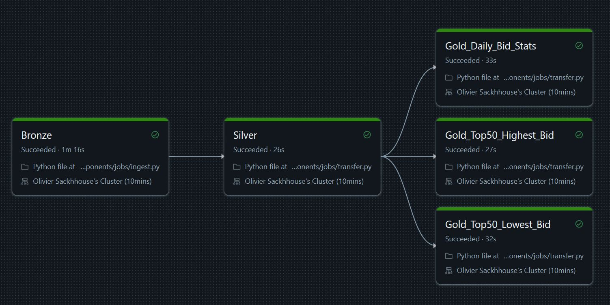

#### Documentation Menu
- [Project Main Documentation](../../../README.md)
<br><br><br>

# Databricks Workflows

## Example of a Databricks workflow



## Defining parameters
Defining parameters makes pipelines possible. When adding a new task in a databricks workflow, we just have to select the proper task type (ingestion, delta transfer, replay...) and pass the proper parameters to tell the task what and how to perform pipelines tasks.

Usualy, parameters are set this way
```python
[
    "-origin_table_name","<Origin of the data to process>",
    "-destination_table_name","Destination of the processed data",
    "-log_table_name","dev.dev_activity_log.transfer_log",    
    "-transform_definiton_path","<Path For transformation rule>",
    "-source_mode","<Incremental or All>",
    "-write_mode","<Append or Overwrite>"
]
```