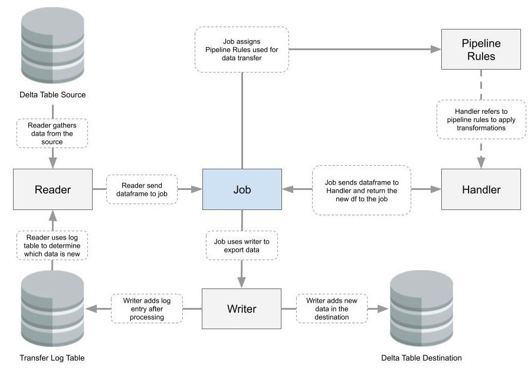

# Main Components

## Description
Components are essential parts of the execution of data pipelines. They are involved in any data movement from origin to destination involving data transformations. Finaly, components are involved in the orchestration of the different steps required for a full pipeline.

## Overview
Components interactions:

## Related Documentation
- [Project Main Documentation](../../../README.md)

## Component: Handler
Handlers are managing data transformations on dataframes and other types of conversions. In most pipelines, the handlers will filter data or dedupe data. Basically the responsibility of a handler is to modify data.

### Handlers responsibilities
- Filter Data
- Convert Data
- Dedupe Data
- Aggregate Data
- Order Data

## Component: Pipeline
The pipelines are basically just defined by the transformation that needs to be done. For instance, between bronze and silver, there is a need for data filtering and deduplication. The filtering rules and de deduplication rules are defined in a pipeline component

### Pipelines responsibilities
- Define operations to be done in order to transfer to the next stage (bronze, silver, gold)

## Component: Reader

## Component: Writer

## Component:Job

## Component: Transfer Log table
The transfer log table is a key component in any pipeline mechanisms. It logs all operations that occurs between the source and the final layer destination.

## ITS INCOMPLETE
| Column  | Description |
| ------------- | ------------- |
| origin_type  | The type of the origin (S3, delta_table, source)  |
| origin_name  | The name of the origin (dev_bronze, dev_silver, dev-landing)  |
| origin_table  | The table of the origin (dev.dev_bronze.stocks)  |
| destination_type  | The type of the destination (dev_bronze, dev_silver, dev-landing)  |
| destination_name  | The name of the destination (S3, delta_table, source)  |
| destination_table  | The table of the destination (stocks)  |
| schema_used  | The schema that was used to store the data  |
| rows_received  | The number of rows that were received for processing  |
| rows_filtered  | The number of rows that were filtered while processing  |
| rows_deduped  | The number of rows that were deduped while processing  |
| rows_added  | The number of rows that were added  |
| processing_time  | The date that the processing was done  |
| transfer_status  | SUCCESS or FAIL after processing  |
| failed_reason  | The reason why the transfer failed  |

