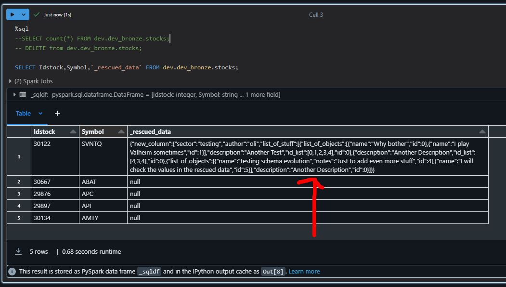

# Databricks Schema Evolution

## Related Elements
- [Databricks Main Doc](./Databricks.md)
- [Databricks Autoloader](./Autoloader.md)

## Required elements
- [Databricks Main Doc](./Schema-definition.md)

## Activating schema evolution
Add the schema evolution mode in the cloudfiles options. This will allow to have a rescued column where we can see the columns that were not parsed
```python
cloudfile_options = {
    ...
    "cloudFiles.schemaEvolutionMode": "rescue",
    ...
}
```

## Example Case: Data not fully parsed, _rescued data is not empty
In specific cases, a new json document could be added with a new attribute that would need to be supported by the ingestion.

After the file was added, we can see the missing data in the rescue column




### This is the actual payload for the new column
```json
"new_column": {
        "author": "oli",
        "sector": "testing",
        "list_of_stuff": [
            {
                "id": 0,
                "description": "Another Test",
                "id_list": [0,1,2,3,4],
                "list_of_objects": [
                    {
                        "id": 0,
                        "name": "Why bother"
                    },
                    {
                        "id": 1,
                        "name": "I play Valheim sometimes"
                    }
                ]
            },
            {
                "id": 0,
                "description": "Another Description",
                "id_list": [4,3,4]
            },
            {
                "id": 0,
                "description": "Another Description",
                "list_of_objects": [
                    {
                        "id": 4,
                        "name": "testing schema evolution",
                        "notes": "Just to add even more stuff"
                    },
                    {
                        "id": 5,
                        "name": "I will check the values in the rescued data"
                    }
                ]
            }
        ]
    }
```

### Activate merge schema in the writeStream options
This will allow to merge new or updated columns in the table. This will be true for the new data coming in the delta table. But in order to correctly process the new schema, we need to change the spark_schema used in the readStream part
```py
(streamingDF.writeStream
  .option("checkpointLocation", checkpoint_path)
  .option("mergeSchema", "true")  # Merge schema option  
  .trigger(availableNow=True)
  .toTable(f"{catalog_name}.{schema_name}.{table_name}", mode="append"))
```

### Updating the schema of the payload that is streamed
We will need to add the new column in the schema file. This file already contain the other column definitions
```py
StructField('new_column',  StructType([
    StructField("author", StringType(), True),
    StructField("sector", StringType(), True),
    StructField("list_of_stuff", ArrayType(StructType([
        StructField("id", IntegerType(), True),
        StructField("description", StringType(), True),
        StructField("id_list", ArrayType(IntegerType()), True),
        StructField("list_of_objects", ArrayType(StructType([
            StructField("id", IntegerType(), True),
            StructField("name", StringType(), True),
            StructField("notes", StringType(), True)
        ])), True)
    ])), True)
]))
```

### Updating the data that still remains in the rescued data
In SQL it is only possible to obtain the schema string by doing the describe first.  Unfortunately, Spark SQL does not provide a built-in SQL-only solution to dynamically fetch the schema of a column.


#### SQL solution
```sql
-- To obtain the proper schema of the new_column, Describe 
DESCRIBE dev.dev_bronze.stocks 
```

```sql
UPDATE dev.dev_bronze.stocks
SET new_column =  from_json(
  get_json_object(_rescued_data,'$.new_column'),
  'struct<author:string,sector:string,list_of_stuff:array<struct<id:int,description:string,id_list:array<int>,list_of_objects:array<struct<id:int,name:string,notes:string>>>>>'
) 
WHERE symbol = 'POIL';
```

#### Python Solution
```python
checkpoint_path = "/mnt/AutoLoader/_checkpoint/stocks"
table_name = 'dev.dev_bronze.stocks'
read_column = '_rescued_data'
target_column = 'new_column'

# Obtain the physical table path
delta_table_path = f"{checkpoint_path}/_delta_log/"

# Load Delta table as DataFrame
df = spark.read.format("delta").load(delta_table_path)

# Get schema of the column
column_schema = str(df.schema[target_column].dataType)

sql = f"""
UPDATE dev.dev_bronze.stocks
SET new_column =  from_json(
    get_json_object(
        _rescued_data,
        '$.new_column'),
    '{column_schema}'
) 
WHERE 
    symbol = 'POIL'
    and get_json_object(_rescued_data,'$.new_column') is not null;
"""

spark.sql(sql)
```


# Doing it manually


### Take backups before performing any schema evolution operations.

#### Create a Copy of the Table:
```sql
CREATE TABLE dev.dev_bronze.stocks_backup AS SELECT * FROM dev.dev_bronze.stocks;
```

#### Store Schema Definition:
```sql
-- Store schema definition as a JSON file
DESCRIBE FORMATTED dev.dev_bronze.stocks;
-- Save the output as a JSON file

-- Store schema definition in a database table
CREATE TABLE schema_backup AS DESCRIBE dev.dev_bronze.stocks;
```

#### Use Version Control:
 If you're using a version control system like Git, you can commit the current schema definition to the repository before making any changes.

 ```bash
 git commit -m "Backup existing schema of dev.dev_bronze.stocks"
 ```

### Updating the schema of the table manually:
The schema of the table will be automatically updated when you add the new column.
```sql
ALTER TABLE dev.dev_bronze.stocks
ADD COLUMN new_column STRUCT<
  author: STRING,
  sector: STRING,
  list_of_stuff: ARRAY<
    STRUCT<
      id: INT,
      description: STRING,
      id_list: ARRAY<INT>,
      list_of_objects: ARRAY<
        STRUCT<
          id: INT,
          name: STRING,
          notes: STRING
        >
      >
    >
  >
>;
```


### Transfer data from the rescued_data field to the new column manually:

```sql
UPDATE dev.dev_bronze.stocks
SET new_column = STRUCT(
  JSON_PARSE(rescued_data['author']) AS author,
  JSON_PARSE(rescued_data['sector']) AS sector,
  TRANSFORM(
    JSON_PARSE(rescued_data['list_of_stuff']),
    x -> STRUCT(
      x['id'] AS id,
      x['description'] AS description,
      TRANSFORM(
        x['id_list'],
        id -> CAST(id AS INTEGER)
      ) AS id_list,
      TRANSFORM(
        x['list_of_objects'],
        obj -> STRUCT(
          obj['id'] AS id,
          obj['name'] AS name,
          obj['notes'] AS notes
        )
      ) AS list_of_objects
    )
  ) AS list_of_stuff
);
```

